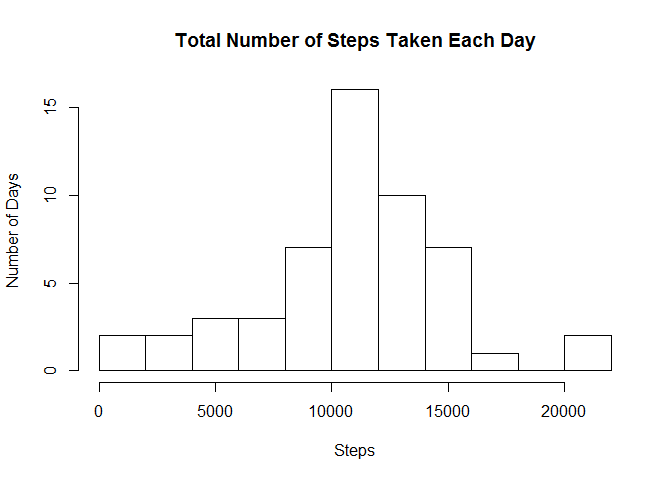
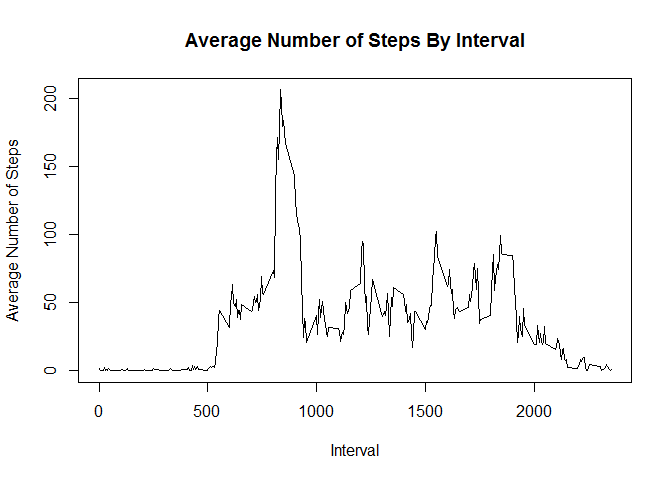
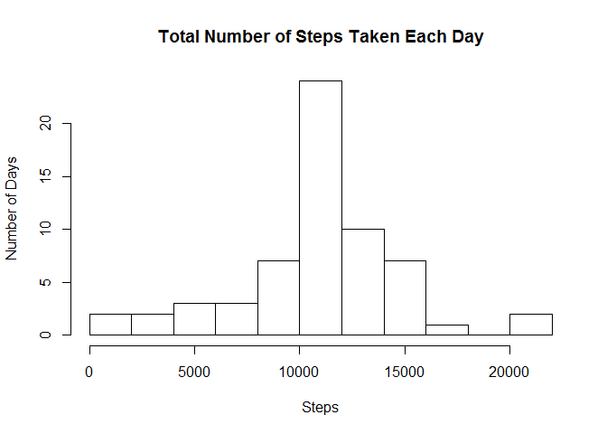
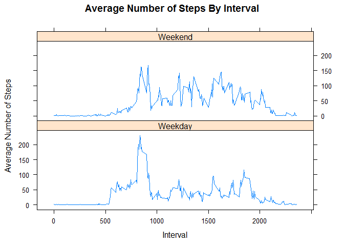

# Reproducible Research: Peer Assessment 1


## Loading and preprocessing the data


```r
#load data set
data <- read.csv(unz("activity.zip", "activity.csv"))

# create datetime from date and interval columns
data$datetime <-
  strptime(
    paste(data$date
          ,formatC(data$interval %/% 100, width=2, format="d", flag="0")
          ,formatC(data$interval %% 100, width=2, format="d", flag="0")
          ,"00"
          ,sep="-")
    ,format="%Y-%m-%d-%H-%M-%S")


data$new_date <- as.Date(data$date, format="%Y-%m-%d")
```


## What is mean total number of steps taken per day?


```r
sum_steps_by_day <- aggregate(data$steps, by=list(data$new_date), FUN=sum)
colnames(sum_steps_by_day) <- c("Date", "Steps")


sum_median <- median(sum_steps_by_day$Steps, na.rm=TRUE)
sum_mean <- mean(sum_steps_by_day$Steps, na.rm=TRUE)

hist(sum_steps_by_day$Steps,
     ,breaks=10 
     ,xlab="Steps" 
     ,ylab="Number of Days"
     ,main="Total Number of Steps Taken Each Day")
```

 

Mean Steps Taken Each Day: 10766.189  
Median Steps Taken Each Day: 10765.000


## What is the average daily activity pattern?


```r
avg_steps_by_interval <- aggregate(data$steps, by=list(data$interval), FUN=mean, na.rm=TRUE)
colnames(avg_steps_by_interval) <- c("interval", "steps")

max_index <- which.max(avg_steps_by_interval$steps)
max_interval <- avg_steps_by_interval[max_index, 1]
  
plot(avg_steps_by_interval$interval
     ,avg_steps_by_interval$steps
     ,type="l"
     ,xlab="Interval"
     ,ylab="Average Number of Steps"
     ,main="Average Number of Steps By Interval")
```

 

The interval that had the most average steps is 835

## Imputing missing values


```r
missing_data <- data[is.na(data$steps),]
missing_values <- nrow(missing_data)


new_data <- data

for(i in 1:nrow(new_data))
{
  if(is.na(new_data[i,]$steps))
  {
    interval <- new_data[i,]$interval
    #new_data[i, ]$steps <- interval
    new_data[i,]$steps <- avg_steps_by_interval[avg_steps_by_interval$interval == interval,]$steps[1]
  }
}
```

The total number of missing values is 2304

Rows with NA for steps are now set to the average for the associated interval.


```r
sum_steps_by_day2 <- aggregate(new_data$steps, by=list(new_data$new_date), FUN=sum)
colnames(sum_steps_by_day2) <- c("Date", "Steps")


sum_median2 <- median(sum_steps_by_day2$Steps)
sum_mean2 <- mean(sum_steps_by_day2$Steps)

hist(sum_steps_by_day2$Steps,
     ,breaks=10 
     ,xlab="Steps" 
     ,ylab="Number of Days"
     ,main="Total Number of Steps Taken Each Day")
```

 


Mean Steps Taken Each Day: 10766.189  
Median Steps Taken Each Day: 10766.189

The effect of replacing NA values with averaged values is that the mean is more concentrated around the median.


## Are there differences in activity patterns between weekdays and weekends?


```r
library(chron)
new_data$isWeekend <- is.weekend(new_data$new_date)

new_data$weekend <- factor(new_data$isWeekend, labels=c("Weekday", "Weekend"))

avg <- aggregate(new_data$steps, by=list(new_data$weekend, new_data$interval), FUN=mean, na.rm=TRUE)
colnames(avg) <- c("weekend", "interval", "x")


library(lattice)
xyplot(avg$x ~ avg$interval | avg$weekend
       ,layout=c(1, 2)
       ,type="l"
       ,xlab="Interval"
       ,ylab="Average Number of Steps"
       ,main="Average Number of Steps By Interval")
```

 

The number of steps increases during non-sleeping hours.
